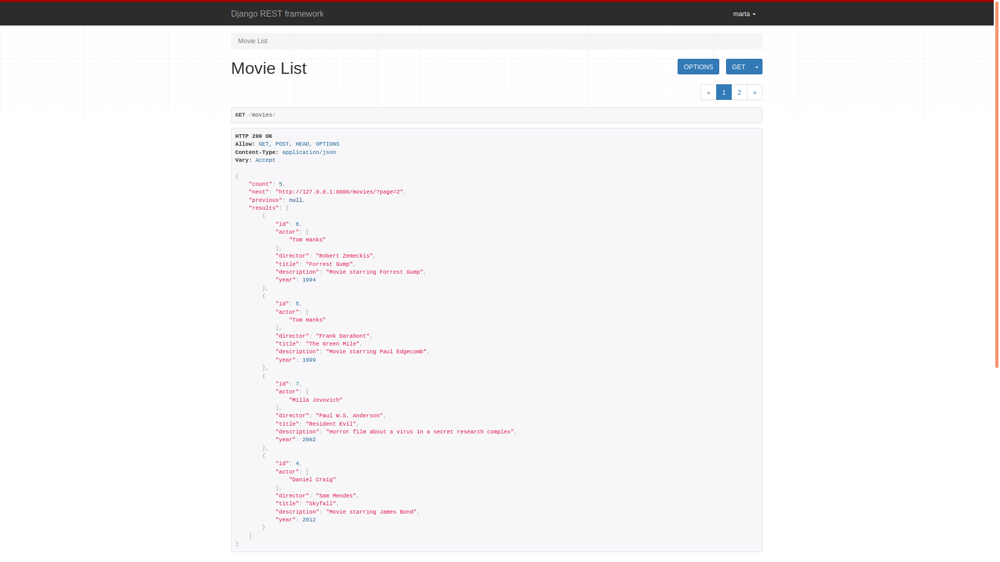
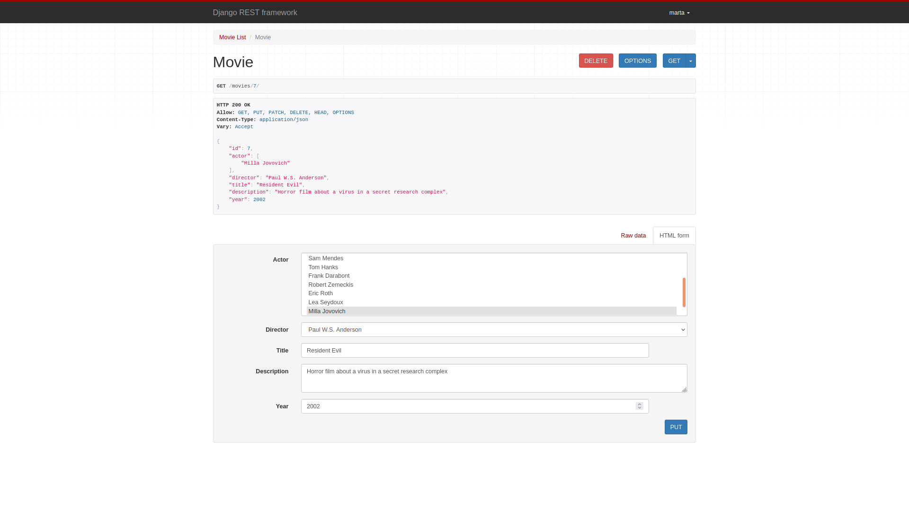
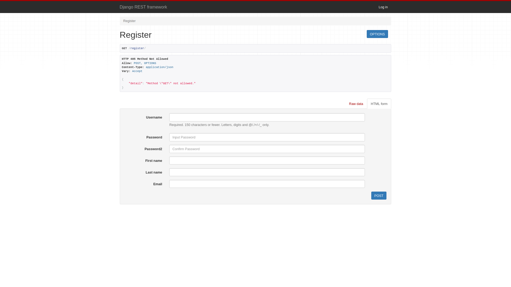

# Cinema REST API App
Application for management cinema using REST API. 

## Table of Contents
* [General info](#general-info)
* [Technologies Used](#technologies-used)
* [Features](#features)
* [Screenshots](#screenshots)
* [Setup](#setup)
* [Usage](#usage)
* [Project Status](#project-status)

## General info
This application manages the cinemas and provide all necessary data to the frontend. It returns the data in JSON (Java
Script Object Notation). Server doesn't keep any information about client (it doesn't use sessions).  
REST is based on the implementation of the methods for each source. In this application the following methods
was used:
* GET - to read a resource from server
* POST - to create a new resource
* PUT - to modify the resource on the server (the entire resource)
* DELETE - to delete the given resource

## Technologies Used
Project is created with:
* Python version: 3.6.9
* Django version: 3.2.11
* psycopg2-binary version: 2.9.3
* djangorestframework version: 3.13.1

## Features
* Models of Person, Movie, Cinema, Screening
* Serializators of Person, Movie, Cinema, Screening, Register and User

* On the `/movies/` page: method GET - returns a list of all cinemas; method POST - creates a new cinema based on the
transferred data
* On the `/movies/<id>` page: method GET - displays information about the cinema with the given id; method PUT - changes
information about the cinema with the given id, method DELETE - deletes the cinema with the given id
* The pages `/cinemas/`, `/cinemas/<id>`, `/screenings/`, `/screenings/<id>` work similar as the above
* Only when you are Authenticated, you can use PUT and DELETE method
* On the `/register/` page, you can register to application
* On the `/user/` page, you can see a list of all users (only with Authenticated permission)
* On the `/user/<id>` page, you can modify a specific user (only with Admin permission)

## Screenshots

### `/movies/` page:

### `/movies/<id>` page:

### `/movies/` page:

## Setup
Project requirements are in _requirements.txt_.  
To get started:
* `pip install -r requirements.txt`
* `python manage.py migrate`

To populate database with data:
* `python manage.py person`
* `python manage.py cinema`
* `python manage.py movie`
* `python manage.py screening`
* `python manage.py relations`

To run application:
* `python manage.py runserver`

## Usage
* After you clone this repo to your desktop, go to its root directory and run `pip install -r requirements.txt`
to install its dependencies
* When the dependencies are installed, make migrations `python manage.py migrate`, populate database and run server 
`python manage.py runserver` to start application
* You will be able to access it at `127.0.0.1:8000`

## Project Status
Project is _complete_.
